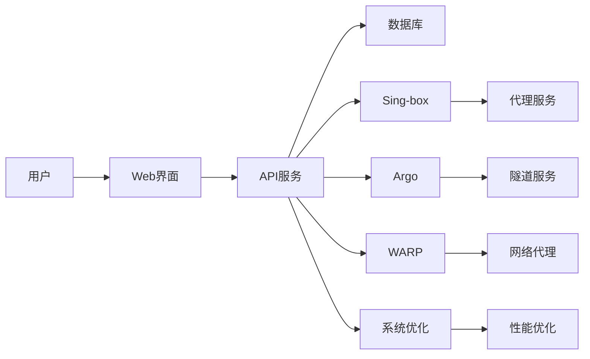

# 妙妙屋 - 全能代理服务器管理系统

一个现代化、功能完整的代理服务器管理系统，集成 Clash 订阅管理和 Sing-box 服务器管理，支持流量监控、节点管理、隧道服务、网络优化等功能。

## 🎯 核心功能

### 📊 Clash 订阅管理
- 📈 **流量监控** - 实时流量统计和历史数据展示
- 🔗 **订阅管理** - 导入、生成、管理 Clash 订阅
- 🎯 **节点管理** - 可视化节点配置编辑和批量操作
- 🔧 **模板系统** - 支持自定义规则模板和代理组配置
- 👥 **用户权限** - 管理员/普通用户角色区分
- 🌓 **响应式设计** - 完美适配桌面端和移动端

### 🛡️ Sing-box 服务器管理（全新）
- 🌐 **Argo隧道管理** - Cloudflare Argo隧道创建和监控
- ⚡ **WARP代理** - Cloudflare WARP网络优化配置
- 🚀 **BBR加速** - 系统级网络性能优化
- 🔗 **订阅生成** - 多格式订阅链接生成和管理
- 📤 **Git同步** - 自动化配置同步到GitLab/GitHub
- 🔐 **证书管理** - SSL/TLS 证书自动化管理

## 🌟 主要特性


### Sing-box 高级功能
- **🌐 Argo隧道**: 固定域名、临时隧道、快速隧道三种模式
- **⚡ WARP优化**: 官方WARP和WARP-GO双支持
- **🚀 BBR加速**: BBR/BBR2/BBR3多版本拥塞控制
- **🔗 订阅管理**: Clash、V2Ray、Sing-box、Base64、JSON多格式
- **📤 Git集成**: GitLab、GitHub、Gist、Pastebin同步
- **🔐 证书服务**: Let's Encrypt ACME和自签名证书

### 技术架构
- 🏗️ **Go后端** - 高性能、并发安全的API服务
- ⚛️ **React前端** - 现代化、响应式的用户界面
- 💾 **SQLite数据库** - 轻量级数据持久化
- 🔒 **JWT认证** - 安全的用户认证和授权
- 🐳 **Docker支持** - 一键部署和容器化运行

## 📦 安装部署

### Docker Compose 部署（推荐）

创建 `docker-compose.yml` 文件：

```yaml
version: '3.8'

services:
  miaomiaowu:
    image: ghcr.io/iluobei/miaomiaowu:latest
    container_name: miaomiaowu
    restart: unless-stopped
    user: root
    environment:
      - PORT=8080
      - DATABASE_PATH=/app/data/traffic.db
      - LOG_LEVEL=info
    
    ports:
      - "8080:8080"
    
    volumes:
      - ./data:/app/data
      - ./subscribes:/app/subscribes
      - ./rule_templates:/app/rule_templates
    
    healthcheck:
      test: ["CMD", "wget", "--no-verbose", "--tries=1", "--spider", "http://localhost:8080/"]
      interval: 30s
      timeout: 3s
      start_period: 5s
      retries: 3
```

启动服务：
```bash
docker-compose up -d
```

### 一键安装（Linux）
```bash
# 下载并运行安装脚本
curl -sL https://raw.githubusercontent.com/iluobei/miaomiaowu/main/install.sh | bash
```

更新到最新版本：
```bash
curl -sL https://raw.githubusercontent.com/iluobei/miaomiaowu/main/install.sh | sudo bash -s update
```

### Windows
```powershell
# 从 Releases 页面下载 mmw-windows-amd64.exe
# 双击运行或在命令行中执行
.\mmw-windows-amd64.exe
```

## 🎮 功能使用指南

### Clash 订阅管理

#### 流量监控
- 📊 实时流量统计和历史数据展示
- 📈 30天历史流量趋势图表展示
- 🔗 订阅流量统计和监控分析

#### 订阅管理
- 📤 上传猫咪配置文件或从订阅URL导入
- 🎯 可视化代理组规则编辑器
- 🌐 支持外部机场节点导入和管理
- 🏷️ 节点标签分类和批量操作

#### 节点管理
- ➕ 支持手动添加节点或从外部订阅导入
- ✏️ 节点配置编辑和批量修改
- 🏷️ 节点标签管理和地区分类
- 🔗 支持多种代理协议转换

### Sing-box 服务器管理

#### 🌐 Argo隧道管理

**功能特性：**
- 🚀 **快速隧道**: 无需token，一键创建临时隧道
- 🔗 **固定域名**: 绑定自定义域名的永久隧道
- ⚙️ **Argo-Go**: 第三方argo客户端支持
- 📊 **实时监控**: 隧道状态、URL、连接状态实时显示
- 🔄 **自动管理**: 启动、停止、删除隧道，5秒自动刷新

**使用场景：**
- 快速穿透内网服务
- 临时端口映射和访问
- 固定域名服务暴露
- 无公网IP的远程访问

#### ⚡ WARP管理

**功能特性：**
- 🌐 **官方WARP**: Cloudflare官方WARP客户端
- 🔧 **WARP-GO**: 第三方WARP实现，支持优选服务器
- 🔑 **License管理**: WARP+账户License配置
- 📊 **连接监控**: 实时连接状态和IP类型检测
- 🌍 **网络优化**: 自动选择最优网络路径

**使用场景：**
- 网络加速和优化
- 解锁地区限制内容
- 提升网络连接质量
- 备用网络通道

#### 🚀 系统优化（BBR）

**功能特性：**
- ⚡ **BBR/BBR2/BBR3**: 多版本拥塞控制算法
- 📊 **系统监控**: CPU、内存、磁盘、网络实时监控
- 🧪 **网络测试**: Ping延迟、DNS解析性能测试
- 🔧 **全面优化**: 一键系统网络参数优化
- 📄 **报告生成**: 详细系统状态报告导出

**性能提升：**
- 高延迟网络吞吐量提升300%+
- 降低网络延迟和丢包率
- 优化TCP连接稳定性
- 提升视频会议和下载速度

#### 🔗 订阅生成器

**支持格式：**
- 📦 **Clash**: 完整的Clash配置文件
- 🌐 **V2Ray**: V2Ray格式的订阅链接
- 🎯 **Sing-box**: 原生Sing-box配置
- 🔒 **Base64**: Base64编码的通用格式
- 📝 **JSON**: 结构化的JSON配置

**功能特性：**
- 🔄 从Sing-box配置自动提取节点
- 🏷️ 节点分类和标签管理
- 🔗 一键生成订阅URL和二维码
- 🔐 AES加密订阅内容
- 📤 多平台配置导出

#### 📤 Git同步

**支持平台：**
- 🦊 **GitLab**: 完整的Git仓库集成
- 🐙 **GitHub**: GitHub仓库同步
- 📋 **Gist**: GitHub Gist代码片段分享
- 📄 **Pastebin**: 在线内容分享

**功能特性：**
- 🔄 自动同步配置到Git仓库
- 🏷️ 版本控制和变更历史
- 🔗 分享链接生成和管理
- ⏰ 定时自动同步
- 📝 提交消息自定义

## 🔧 技术特点

### 后端架构
- ⚡ **Go 1.21+**: 高性能并发处理
- 🗄️ **SQLite**: WAL模式，高并发写入
- 🔐 **JWT**: 安全的用户认证
- 📊 **RESTful API**: 标准化接口设计
- 🎯 **模块化**: 清晰的代码组织结构

### 前端技术
- ⚛️ **React 18**: 现代化前端框架
- 🎨 **Tailwind CSS**: 实用优先的CSS框架
- 📱 **响应式设计**: 完美移动端适配
- 🔄 **TanStack Router**: 类型安全路由
- 🎨 **Radix UI**: 高质量UI组件库

### 系统特性
- 🏗️ **单二进制**: 无依赖部署
- 💾 **数据持久化**: SQLite数据库存储
- 🐳 **Docker支持**: 容器化部署
- 📊 **监控告警**: 流量异常监控
- 🌓 **主题切换**: 亮色/暗色模式

## 📊 功能对比

### vs 传统订阅管理

| 功能 | 传统订阅管理 | 妙妙屋 |
|------|------------|---------|
| 订阅管理 | ✅ | ✅ |
| 节点配置 | ✅ | ✅ |
| 流量监控 | ✅ | ✅ |
| 服务器管理 | ❌ | ✅ |
| 隧道服务 | ❌ | ✅ |
| 网络优化 | ❌ | ✅ |
| Git同步 | ❌ | ✅ |

### vs Sing-box Bash脚本

| 功能 | Bash脚本 | 妙妙屋 |
|------|----------|---------|
| 安装管理 | ✅ | ✅ |
| 配置管理 | ✅ | ✅ |
| 服务管理 | ✅ | ✅ |
| 证书管理 | ✅ | ✅ |
| 高级功能 | ⚠️ | ✅ |
| Web界面 | ❌ | ✅ |
| 实时监控 | ❌ | ✅ |
| 混合环境 | ❌ | ✅ |

## 🎯 使用场景

### 个人用户
- 🏠 **家庭网络**: 内网服务暴露和远程访问
- 📱 **移动优化**: 随时随地管理配置
- 🎮 **游戏加速**: 降低游戏延迟和丢包
- 📺 **视频优化**: 提升流媒体体验

### 小团队
- 👥 **团队协作**: 多用户权限管理
- 🔄 **自动化**: 定时同步和备份
- 📊 **监控告警**: 流量异常监控
- 🛡️ **安全防护**: 网络安全配置管理

### 开发者
- 🔧 **API接口**: 完整的RESTful API
- 📝 **开发调试**: 实时日志和状态监控
- 🧪 **功能测试**: 网络性能测试工具
- 🔄 **CI/CD**: Git集成自动化部署

## 🚀 快速开始

### 1. 部署系统

```bash
# Docker方式部署
git clone https://github.com/iluobei/miaomiaowu.git
cd miaomiaowu
docker-compose up -d
```

### 2. 访问界面

```bash
# 访问Web界面
http://your-server:8080

# 默认登录
账户: admin
密码: admin123
```

### 3. 开始使用

1. **Clash订阅**: 导入或生成订阅配置
2. **流量监控**: 查看实时流量统计和历史趋势
3. **Argo隧道**: 创建隧道暴露内网服务
4. **系统优化**: 启用BBR加速网络
5. **Git同步**: 配置自动同步备份

## 📈 系统要求

### 最低要求
- **CPU**: 1核心
- **内存**: 512MB RAM
- **磁盘**: 1GB 可用空间
- **系统**: Linux/Windows/macOS

### 推荐配置
- **CPU**: 2核心+
- **内存**: 2GB RAM+
- **磁盘**: 10GB+ 可用空间
- **系统**: Ubuntu 20.04+/Debian 11+

### 网络要求
- **带宽**: 10Mbps+
- **端口**: 8080（Web服务）
- **权限**: 需要root权限安装Sing-box

## 🔒 安全特性

- 🛡️ **JWT认证**: 安全的用户认证机制
- 👥 **权限控制**: 管理员和普通用户角色分离
- 📝 **审计日志**: 完整的操作日志记录
- 🔐 **命令白名单**: 防止命令注入攻击
- 🌐 **HTTPS支持**: SSL/TLS加密通信

## 📞 支持与帮助

### 联系方式
- 📧 **问题反馈**: [GitHub Issues](https://github.com/iluobei/miaomiaowu/issues)
- 💬 **功能建议**: [GitHub Discussions](https://github.com/iluobei/miaomiaowu/discussions)
- 📚 **使用文档**: [在线文档](https://docs.miaomiaowu.net)

### 体验Demo
- 🌐 **在线体验**: [demo.miaomiaowu.net](https://demo.miaomiaowu.net)
- 🔑 **测试账户**: test / test123

## 🗺️ 路线图



## 📊 Star History

[](https://www.star-history.com/#iluobei/miaomiaowu&type=date&legend=top-left)

## 🤝 贡献

欢迎提交 Issue 和 Pull Request！

### 贡献指南
1. Fork 本仓库
2. 创建特性分支 (`git checkout -b feature/AmazingFeature`)
3. 提交更改 (`git commit -m 'Add some AmazingFeature'`)
4. 推送到分支 (`git push origin feature/AmazingFeature`)
5. 开启 Pull Request

## 📄 许可证

MIT License - 详见 [LICENSE](LICENSE) 文件

## ⚠️ 免责声明

- 本程序仅供学习交流使用，请勿用于非法用途
- 使用本程序需遵守当地法律法规
- 作者不对使用者的任何行为承担责任
- 请遵守相关服务提供商的使用条款

## 🎉 致谢

感谢所有贡献者和使用者的支持！

### 相关项目
- [Clash](https://github.com/Dreamacro/clash)
- [Sing-box](https://github.com/SagerNet/sing-box)
- [Cloudflare WARP](https://1.1.1.1/)
- [Argo Tunnels](https://argotunnel.net)

---

**Made with ❤️ by iluobei**
